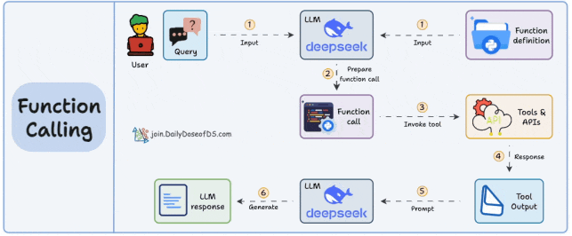
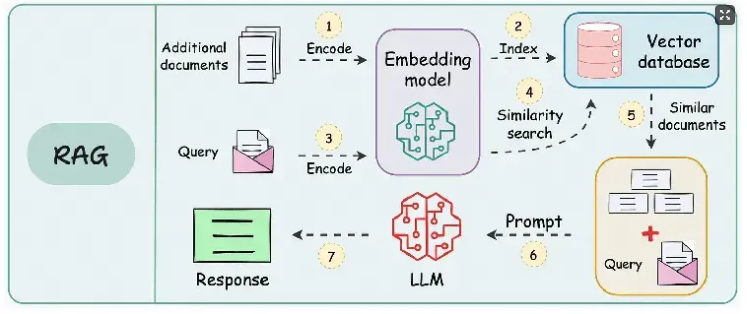
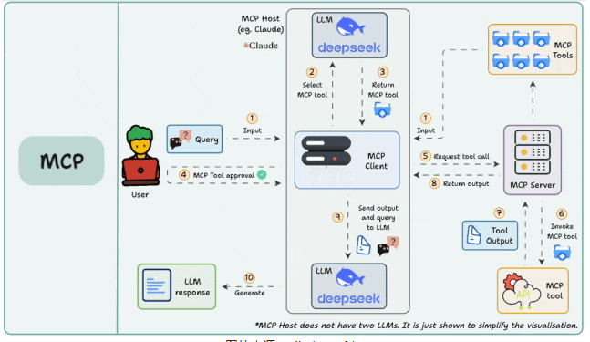

# MCP简介

## 传统function calling和RAG
function calling：

RAG：

## MCP

- 三个核心组件：
1. MCP host：希望通过MCP访问数据的程序，例如Claude Desktop、IDE或AI工具（可以简单理解为LLM）
2. MCP 客户端：与服务器保持 1:1 连接的协议客户端
3. MCP 服务器：轻量级程序，每个程序都同故宫标准化模型上下文协议公开特定功能

- 整体流程：
首先需要在主机上自动或手动配置 MCP 服务，当用户输入问题时， MCP 客户端让 大语言模型选择 MCP 工具，大模型选择好 MCP 工具以后， MCP 客户端寻求用户同意（很多产品支持配置自动同意），MCP 客户端请求 MCP 服务器， MCP 服务调用工具并将工具的结果返回给 MCP 客户端， MCP 客户端将模型调用结果和用户的查询发送给大语言模型，大语言模型组织答案给用户。

- 相比于传统function calling和RAG的优势在于：
1. MCP将function calling和RAG都集成到MCP Server中，即MCP server既可以调用工具也可以连接数据库（其实RAG也可以理解成一个function calling的过程）
2. 无需因工具的变化（比如增删参数）而频繁的修改**调用工具API的代码**，模型可以自适应的用MCP客户端连接MCP服务器，发送初始请求了解服务器的能力，从而根据返回的信息提供需要的内容。（这就可以理解为协议，就是大家都按照这个模式来工作）
3. function calling是同步调用，MCP是异步协议
4. function calling通常仅支持单次函数调用，且受限于预定义的操作集合。MCP支持动态上下文管理和并行请求，例如同时从多个服务器获取数据并整合结果，显著提升复杂工作流的效率。

# 参考文献
https://developer.aliyun.com/article/1665090

# GraphRAG

传统RAG的问题：
1. chunking切块问题，无论是按句子，按字数，按段落分块，或者直接用大模型来判断从哪里切分，都没有一种方式能够适配所有的问题。
2. 缺乏全局视野。比如有个问题问“这篇文章出现了多少个'我'字”，这种和所有的块都沾边的问题，RAG一般是无法处理的。

